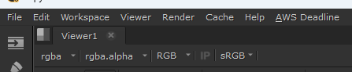

# Using the Deadline Cloud submitter installer

You can install the Deadline Cloud for Nuke submitter using the Deadline Cloud submitter installer.

**To install the submitter**

1. Download the [Deadline Cloud submitter installer](https://docs.aws.amazon.com/deadline-cloud/latest/userguide/submitter.html).
1. Run the installer.
1. When prompted to select components, find and mark the checkbox for Nuke.

1. Finish running the installer.
1. Launch Nuke.
1. Verify the installation by checking if **AWS Deadline** has been added to the top navigation bar.

