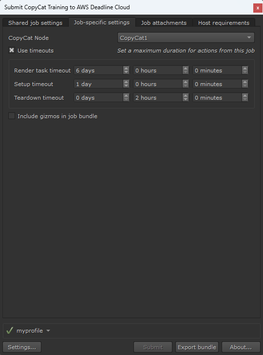

# CopyCat Training Jobs Using the Deadline Cloud for Nuke submitter

To use the Deadline Cloud for Nuke submitter to train CopyCat nodes, you will need:

- A profile to submit to Deadline Cloud with
- A Deadline Cloud farm and queue to submit to
- A Deadline Cloud fleet with GPU-enabled workers associated with the queue you will be submitting to. For instructions on creating a service-managed fleet with GPU access, see [Managing service-managed fleets](https://docs.aws.amazon.com/deadline-cloud/latest/userguide/smf-manage.html).

## Submit a job

**To submit a CopyCat training job from Nuke to Deadline Cloud**

1. Create or open a Nuke Script containing a CopyCat node.
1. Attach ground truth and input nodes to the CopyCat Node, and configure knobs on the node to desired values. See [Foundry's documentation](https://learn.foundry.com/nuke/content/reference_guide/air_nodes/copycat.html) for details on using CopyCat.
1. Save your Nuke file.
1. From the top navigation bar, choose **AWS Deadline**. From the drop down menu, select **Submit CopyCat Training to Deadline Cloud**.
1. Use the tabs in the dialog to customize your job.
1. (Optional) To export a job's associated files to your job history directory without submitting it, choose **Export bundle**.
    - A _job bundle_ is a group of files that defines a job. For more information, see [Open Job Description templates for Deadline Cloud](https://docs.aws.amazon.com/deadline-cloud/latest/developerguide/build-job-bundle.html).
1. Choose **Submit** and follow the prompts to send your job to Deadline Cloud.

## Nuke CopyCat training-specific settings
The **Job-specific settings** tab has options specific to jobs created in Nuke.

  - *CopyCat Node* - Select which CopyCat node to train by node name.
  - *Use timeouts* - Whether or not to use user configured timeouts.
  - *Render task timeout* - Maximum duration of each action. In the case of CopyCat, the training is a single action. Default is 6 days.
  - *Setup timeout* - Maximum duration of each action which sets up the job, such as scene load. Default is 1 day.
  - *Teardown timeout* - Maximum duration of action which tears down the setup. Default is 1 hour.
  - *Include gizmos in job bundle* - Whether or not to include [gizmos](https://learn.foundry.com/nuke/content/comp_environment/configuring_nuke/creating_sourcing_gizmos.html) in the job bundle.

For information about the other submitter tabs, see the [AWS Deadline Cloud guide for using a submitter](https://docs.aws.amazon.com/deadline-cloud/latest/userguide/jobs-using-submitter.html).

## Monitoring your jobs

You can monitor job progress using the Deadline Cloud monitor. For more information, see the [AWS Deadline Cloud guide for using the monitor](https://docs.aws.amazon.com/deadline-cloud/latest/userguide/working-with-deadline-monitor.html).

## Getting help

- Contact AWS Support
- (Requires a GitHub account) [Open an issue in `deadline-cloud-for-nuke` on GitHub](https://github.com/aws-deadline/deadline-cloud-for-nuke/issues)