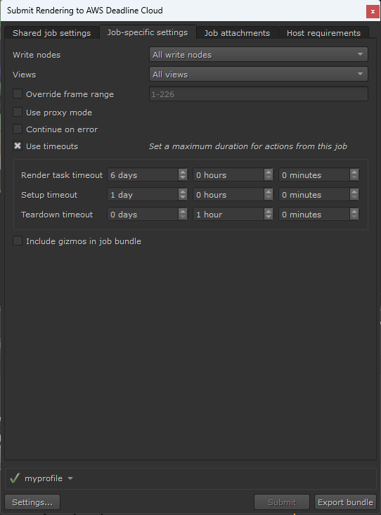

# Render Jobs Using the Deadline Cloud for Nuke submitter

To use the Deadline Cloud for Nuke submitter, you will need:

- A profile to submit to Deadline Cloud with
- A Deadline Cloud farm and queue to submit to

## Submit a job

**To submit a render job from Nuke to Deadline Cloud**

1. Save your Nuke file.
1. From the top navigation bar, choose **AWS Deadline**. From the drop down menu, select **Submit to Deadline Cloud**.
1. Use the tabs in the dialog to customize your job.
1. (Optional) To export a job's associated files to your job history directory without submitting it, choose **Export bundle**.
    - A _job bundle_ is a group of files that defines a job. For more information, see [Open Job Description templates for Deadline Cloud](https://docs.aws.amazon.com/deadline-cloud/latest/developerguide/build-job-bundle.html).
1. Choose **Submit** and follow the prompts to send your job to Deadline Cloud.

## Nuke render-specific settings
The **Job-specific settings** tab has options specific to jobs created in Nuke.

  - *Write nodes* - Which [write nodes](https://learn.foundry.com/nuke/content/comp_environment/rendering/output_write_nodes.html) to render outputs for. You can either select to render all write nodes, or select a specific node.
  - *Views* - Which [views](https://learn.foundry.com/nuke/content/comp_environment/stereoscopic_films/setting_up_stereo_views.html) should be rendered.
  - *Override frame range* - Select this to render a different frame or frame range than is set in Nuke. Frame ranges follow the [Open Job Description](https://github.com/OpenJobDescription/openjd-specifications/wiki/2023-09-Template-Schemas#34111-intrangeexpr) pattern.
  - *Use proxy mode* - Manages whether to use [proxy mode](https://learn.foundry.com/nuke/9.0/content/getting_started/managing_scripts/proxy_mode.html) in the submitted job.
  - *Continue on error* - If set, try to continue rendering if Nuke encounters an error. If false, in the case of an error the task is failed.
  - *Use timeouts* - Whether or not to use user configured timeouts.
  - *Render task timeout* - Maximum duration of each action which performs a render. Default is 6 days.
  - *Setup timeout* - Maximum duration of each action which sets up the job for rendering, such as scene load. Default is 1 day.
  - *Teardown timeout* - Maximum duration of action which tears down the setup required for rendering. Default is 1 hour.
  - *Include gizmos in job bundle* - Whether or not to include [gizmos](https://learn.foundry.com/nuke/content/comp_environment/configuring_nuke/creating_sourcing_gizmos.html) in the job bundle.

For information about the other submitter tabs, see the [AWS Deadline Cloud guide for using a submitter](https://docs.aws.amazon.com/deadline-cloud/latest/userguide/jobs-using-submitter.html).